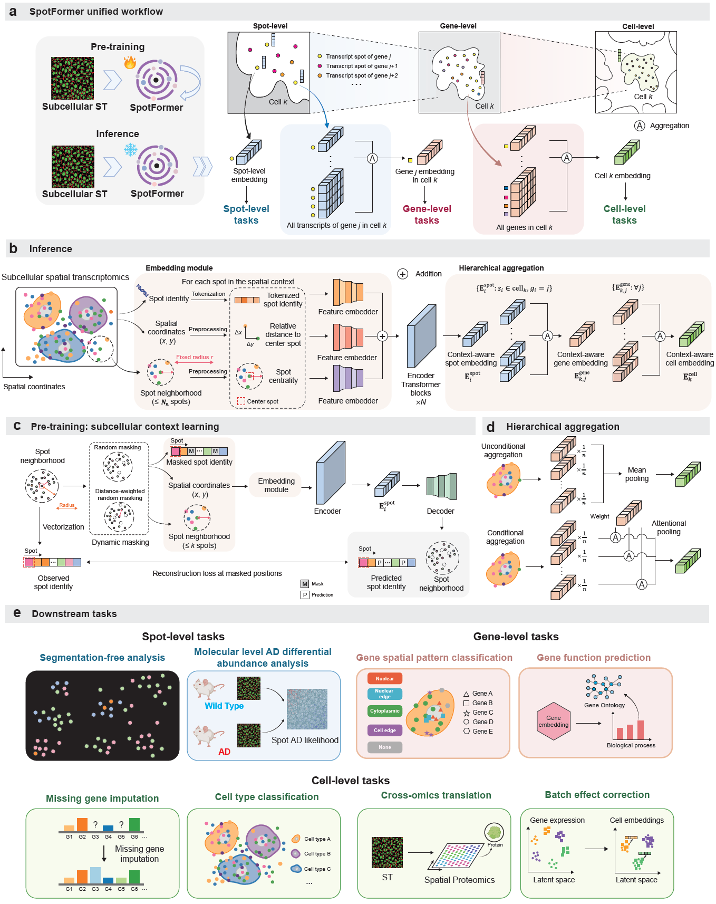

Welcome to SpotFormer's documentation!
===================================
SpotFormer: subcellular pre-training unifies multi-scale spatial transcriptomic analysis.
====================================================================================================================================================

.. toctree::
   :maxdepth: 2
   :caption: Contents:

   installation
   notebooks/T1_spot_input_gen
   notebooks/T2_pretrain
   notebooks/T3_segmentation_free_analysis
   notebooks/T4_AD_differential_abundance_analysis
   notebooks/T5_gene_level_analysis
   notebooks/T6_cell_level_analysis
   notebooks/T7_batch_effect_correction

Overview
========
Subcellular spatial organization of transcripts encodes fundamental regulatory principles of cellular function, yet current computational methods largely compress molecule-level information into cell-level summaries, discarding critical spatial context. Motivated by parallels between molecular distributions in space and tokens in a sequence, we develop SpotFormer, a Transformer-based pre-trained model that learns context-aware representations of individual transcript molecules from high-resolution spatial transcriptomics data. SpotFormer employs a novel subcellular context learning objective and a hierarchical aggregation mechanism that together capture spatial dependencies from molecules to genes and cells. Pre-trained on millions of spatially resolved transcripts, SpotFormer produces molecular embeddings that transfer to diverse downstream analyses without retraining. At the transcript level, it enables segmentation-free subcellular analysis. At the gene level, it improves spatial pattern prediction and functional annotation. At the cell level, it boosts missing-gene imputation, cell type classification, cross-omics translation, and batch effect correction, leveraging conserved subcellular distribution patterns across batches and platforms to achieve robust characterization of cell states. Importantly, SpotFormer reveals spatial context-dependent disease associations at molecular resolution in Alzheimer’s disease, uncovering subcellular pathological heterogeneity invisible to conventional cell-based analysis. SpotFormer establishes a new paradigm for analyzing spatial transcriptomics data at subcellular resolution.
